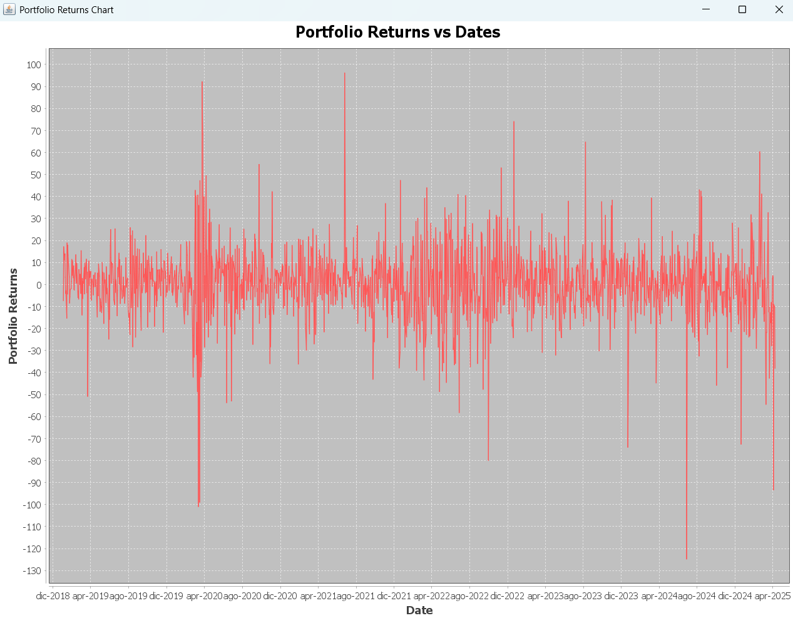
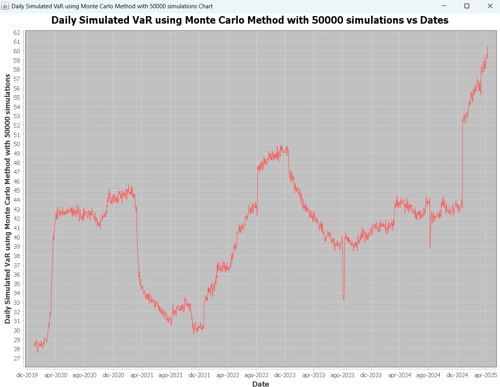

# Financial Risk Management - VaR & ES Simulation

> **Project developed for the "Financial Risk Management" course at Università di Verona.**

## Project Overview
This Java application is designed to perform risk analysis on an investment portfolio (composed of **Nike** and **Novo Nordisk** equities). It calculates and compares **Value at Risk (VaR)** and **Expected Shortfall (ES)** using two different methodologies:
1.  **Historical Simulation**: Based on historical return distributions.
2.  **Monte Carlo Simulation**: Based on generated scenarios (Normal Distribution assumption).

The software adheres to Object-Oriented Programming (OOP) principles and implements a **Rolling Window analysis** to visualize how risk measures evolve over time.

## Key Features
* **Data Ingestion**: Historical price series were retrieved from **Yahoo Finance using R**, exported as CSV, and parsed using **Apache POI**.
* **Risk Metrics Engine**:
    * Computation of **Historical VaR and ES** by sorting empirical returns.
    * **Monte Carlo Engine**: Simulation of 50,000 scenarios per step using Inverse Transform Sampling on Log-Returns.
* **Time Series Analysis**: Implementation of iterative (rolling window) calculations to backtest risk measures against time.
* **Visualization**: Dynamic plotting of Prices, Returns, and Risk Measures using **JFreeChart**.

## Project Structure
The project follows the standard Maven directory structure and is organized into the following packages:

* `it.univr.riskmanagement`:
    * `DataCollectionAndPlotting`: Handles Excel parsing and chart generation.
    * `DataManagement`: Manages portfolio P&L calculations and statistics (Mean, Std Dev).
    * `RiskMeasures`: Implements the core logic for Historical VaR/ES.
    * `MonteCarloSimulation`: Implements the stochastic simulation engine.
    * `Tests`: Main execution class.

## Tech Stack
* **Java 17**
* **Maven**: Dependency management.
* **Apache POI**: For handling Excel data imports.
* **Apache Commons Math**: For statistical distributions.
* **JFreeChart**: For data visualization.

## How to Run
1.  Clone the repository.
2.  Ensure the data files (`NIKE.xlsx`, `NOVO.xlsx`) are present in the resource folder.
3.  Run the `Tests` class located in `src/main/java/it/univr/riskmanagement/Tests.java`.

The application will:
1.  Plot the historical prices of the assets.
2.  Plot the portfolio's absolute returns.
3.  Calculate and print historical VaR and ES for the specified window.
4.  Run the Monte Carlo simulation and compare the results.
5.  Generate charts showing the evolution of Risk Measures over time.

### Example Output
```text
I rendimenti assoluti del nostro portafolgio sono:
[-7.364, 17.111, 11.135, ...]

I VaR storici dal giorno 251 al giorno 1575 sono:
[24.809, 24.809, 24.809, ...]

Gli ES storici dal giorno 251 al giorno 1575 sono:
[24.809, 24.809, 24.809, ...]

I VaR storici simulati dal giorno 251 al giorno 1575 sono:
[28.236, 28.707, 28.525, ...]

Gli ES storici simulati dal giorno 251 al giorno 1575 sono:
[28.655, 28.560, 28.540, ...]
```
### Example Plotting





## Authors & Acknowledgments

**Development Team:**
* Lorenzo Visonà Dalla Pozza
* Davide Barberis
* Marco Bombarda
* Alberto Oliva Medin

**Credits:**
* This project is based on a template provided by **Prof. Alessandro Munari**, specifically regarding the **data import management**.
* The implementation of **Risk Measures (VaR/ES)**, **Monte Carlo Simulation**, and **Rolling Window Analysis** was developed by the team as part of the project work.
* Market data was sourced from **Yahoo Finance** via **R scripts** and converted for analysis.
